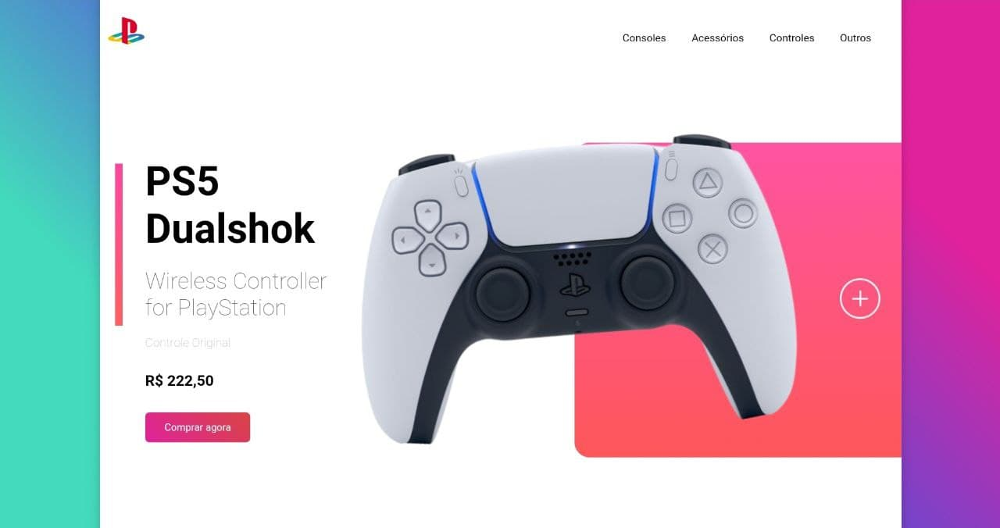
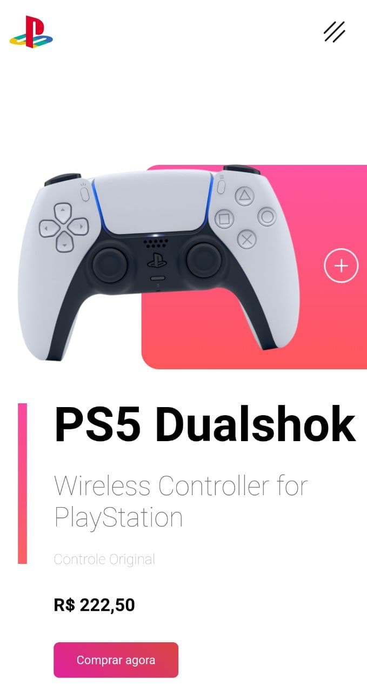
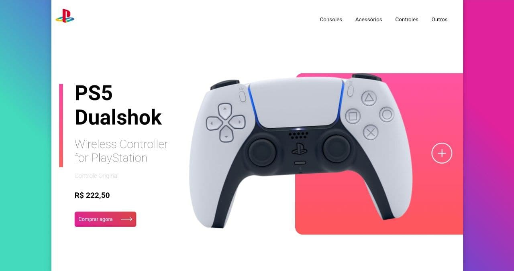

# Playstation Store

  
 

## About the project

https://playstationstorecss.netlify.app/

Playstation Store is a web and mobile front-end application built during an online class available on youtube.

The application consists of a front-end website template, based on the playstation store.

### Layout mobile

 

 

 

 
### Layout web

  
  
 

## Technologies used

### Front end
- HTML
- CSS

### Deployment in production
- Front end web: Netlify

## Settings and improvements

The project is still in development and the next updates will focus on the following tasks:

- [x] Create HTML
- [x] Create CSS
- [ ] Create JavaScript
- [ ] Layout Update

## Contributors

We thank the following people who contributed to this project:

<table>
  <tr>
    <td align="center">
      <a href="#">
         
        
          <b>Daiana de Paula</b>
        
      </a>
    </td>
    
</table>

## License

 

 

